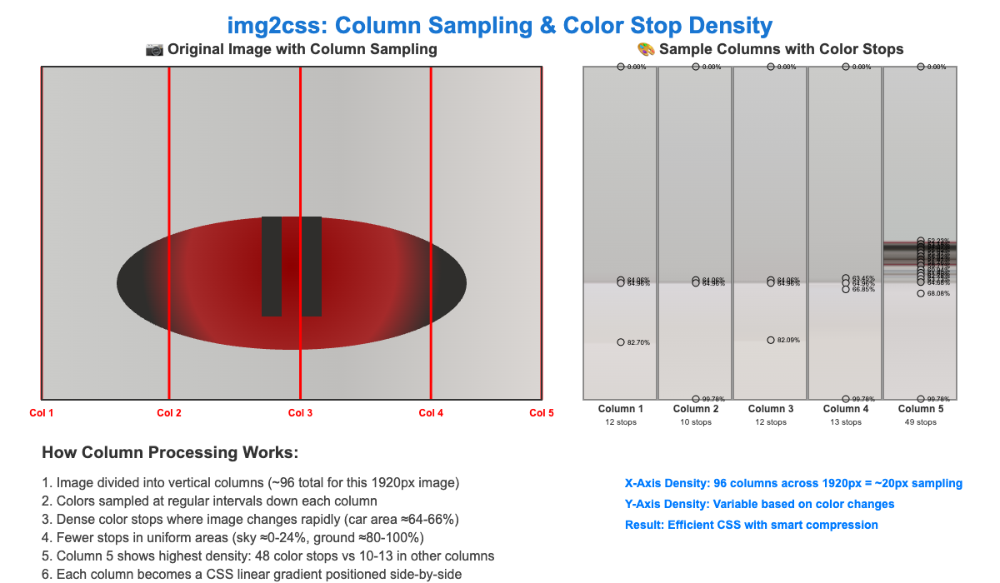

# img2css

A powerful JavaScript class for converting images into pure CSS gradients with advanced processing options including posterization, hybrid processing modes, and intelligent compression.

## 🔒 **Copyright Protection Use Case**

Perfect for protecting copyrighted images while maintaining visual appeal:

- **No downloadable files** - Images become pure CSS, can't be right-clicked and saved
- **Server-side processing** - Original images never leave your backend
- **Reverse-engineering proof** - Impossible to recreate original from CSS gradients  
- **Better than watermarks** - Maintains clean visual presentation
- **Ideal for**: Photo galleries, stock photo previews, artist portfolios, premium content

## 🌟 [**Try Live Demo**](https://codepen.io/digitalisstudios/full/OPMPPaZ)

## Installation

Include the standalone JavaScript class in your project:

```html
<script src="img2css.js"></script>
```

Or use the CDN:

```html
<script src="https://cdn.jsdelivr.net/gh/digitalisstudios/img2css/src/img2css.js"></script>
```

Or import as a module:

```javascript
import img2css from './img2css.js';
```

## Basic Usage

### Simple Usage (Recommended)

```javascript
// Create converter with image source and options
const converter = new img2css({ 
    source: '/path/to/image.jpg',
    selector: '.my-gradient',
    processing: {
        details: 80,
        compression: 15,
        mode: 'auto'
    }
});

// Generate CSS - that's it!
const css = await converter.toCSS();
console.log(css); // CSS class string ready to use

// Optional: Access detailed stats from last conversion
console.log(converter.stats.settings); // Applied settings and dimensions
```

### Minimal Usage

```javascript
// Use defaults (details: 100, compression: 15, processingMode: 'auto')
const converter = new img2css({ source: '/path/to/image.jpg' });
const css = await converter.toCSS();
```

### From File Upload

```javascript
// Simple one-liner
const css = await (new img2css({ 
    source: fileInput.files[0],
    selector: '.upload-gradient',
    processing: {
        details: 80,
        compression: 15
    }
})).toCSS();
```

### From Data URL String

```javascript
// Usage with base64 data URL
const dataUrl = 'data:image/png;base64,iVBORw0KGgoAAAANSUhEUgAA...';
const css = await (new img2css({ 
    source: dataUrl,
    selector: '.data-gradient',
    processing: {
        details: 80,
        compression: 15
    }
})).toCSS();
```

### From Canvas ImageData

```javascript
// Direct usage with existing canvas ImageData
const canvas = document.getElementById('myCanvas');
const ctx = canvas.getContext('2d');
const imageData = ctx.getImageData(0, 0, canvas.width, canvas.height);

// Simple one-liner
const css = await (new img2css({ 
    source: imageData,
    selector: '.canvas-gradient',
    processing: {
        details: 90,
        compression: 10,
        mode: 'hybrid'
    }
})).toCSS();
```

## 🔍 How It Works

img2css analyzes images by sampling colors at regular intervals and converts them into CSS gradients. The visual below demonstrates the process:



### Processing Modes

**Column Processing (Landscape Images)**
- Image analyzed in vertical strips
- Each column sampled at regular intervals  
- Produces horizontal CSS gradients positioned vertically
- Best for landscape/wide images

**Row Processing (Portrait Images)**
- Image analyzed in horizontal strips  
- Each row sampled at regular intervals
- Produces vertical CSS gradients positioned horizontally
- Best for portrait/tall images
- *Same principle as column processing, rotated 90°*

**Hybrid Processing (Square Images)**
- Combines both column and row processing
- Provides the best balance for complex images
- Automatically selected for square or near-square images

> **Note:** Row processing works identically to column processing, just rotated 90 degrees. Instead of vertical sampling lines creating horizontal gradients, you get horizontal sampling lines creating vertical gradients. The same intelligent color stop density applies - more stops where the image has detail, fewer where it's uniform.

### Sampling & Quality

The red lines in the demo show **sampling points** where colors are extracted:

- **Higher Details** (80-100%): More sampling points = more accurate but larger CSS
- **Lower Details** (20-60%): Fewer sampling points = smaller CSS but less detail
- **Compression**: Reduces similar adjacent colors to optimize file size

## Configuration Options

### Constructor Parameters

| Parameter | Type | Default | Description |
|-----------|------|---------|-------------|
| `source` | string\|File\|ImageData | required | Image source (URL, File object, or Canvas ImageData) |
| `selector` | string | '.slick-img-gradient' | CSS selector for the generated gradient (supports any CSS selector: `.class`, `#id`, `div.class > a:hover`) |
| `processing` | object | {} | Processing configuration (see below) |
| `autoOptimize` | boolean | false | Automatically find optimal settings |
| `maxSize` | string\|number\|null | null | Target file size limit (numeric values default to KB, supports "MB" suffix) |
| `minified` | boolean | false | Minify CSS output |

#### Selector Examples

The `selector` parameter supports any valid CSS selector:

```javascript
// Class selector (default)
new img2css({ source: 'image.jpg', selector: '.my-gradient' })

// ID selector  
new img2css({ source: 'image.jpg', selector: '#hero-background' })

// Complex selectors
new img2css({ source: 'image.jpg', selector: '.card .background' })
new img2css({ source: 'image.jpg', selector: 'div.hero > .bg-layer' })
new img2css({ source: 'image.jpg', selector: '.gallery-item:hover::before' })
```

### Processing Configuration (`processing` object)

| Parameter | Type | Default | Range | Description |
|-----------|------|---------|-------|-------------|
| `details` | number | 100 | 0-100 | Processing detail level (higher = more detail, larger output) |
| `compression` | number | 15 | 0-100 | Color reduction level (higher = smaller output, less accuracy) |
| `mode` | string | 'auto' | See modes | Gradient direction processing mode |
| `posterize` | number | 0 | 0.0-1.0 | Posterization strength (0 = off, 1 = full palette limiting) |
| `useOriginalPalette` | boolean | false | - | Limit colors to original image palette |

### Backward Compatibility

The library supports the old flat configuration structure for backward compatibility:

```javascript
// Still works - old flat structure
const converter = new img2css({
    source: '/path/to/image.jpg',
    details: 80,
    compression: 15,
    processingMode: 'auto'
});
```

### Processing Modes (`processing.mode`)

- **`'auto'`**: Automatically detects image orientation and chooses optimal gradient direction
- **`'rows'`**: Generates horizontal gradients (left-to-right)
- **`'columns'`**: Generates vertical gradients (top-to-bottom)
- **`'hybrid'`**: Combines both directions with edge detection for superior accuracy

## Advanced Features

### Posterization

Limit gradients to colors from the original image palette:

```javascript
const css = await (new img2css({
    source: '/path/to/image.jpg',
    selector: '.posterized-gradient',
    processing: {
        details: 80,
        compression: 10,
        posterize: 0.7  // 70% blend to original palette
    }
})).toCSS();
```

Posterization strength controls the blend between sampled colors and nearest palette colors:
- `0.0`: No posterization (normal gradient sampling)
- `0.5`: 50% blend between sampled and palette colors
- `1.0`: Full posterization (colors snap to original palette)

### Hybrid Processing

Best quality output by combining multiple gradient directions:

```javascript
const css = await (new img2css({
    source: '/path/to/image.jpg',
    selector: '.hybrid-gradient',
    processing: {
        details: 90,
        compression: 5,
        mode: 'hybrid'  // Uses both row and column analysis
    }
})).toCSS();
```

Hybrid mode combines both horizontal and vertical gradient analysis for the highest quality results.

### Automatic Upscaling

Small images are automatically upscaled for better gradient quality.

### Intelligent Compression

Even at 0% compression, similar colors are automatically merged for cleaner output:

```javascript
const css = await (new img2css({
    source: '/path/to/image.jpg',
    selector: '.zero-compression-gradient',
    processing: {
        details: 100,
        compression: 0  // Still removes near-duplicate colors
    }
})).toCSS();
```

## API Reference

### Constructor

```javascript
new img2css(config = {})
```

Optional configuration object with default values for all processing options.

### Methods

#### `toCSS()`

Main processing method that converts the configured source to CSS gradient.

**Parameters:** None (uses constructor configuration)

**Returns:** Promise resolving to CSS string

**Note:** Detailed stats from the conversion are stored in `this.stats` property

#### `stats` Property

After calling `toCSS()`, this property contains detailed information about the conversion:

```javascript
const converter = new img2css({ source: '/path/to/image.jpg' });
const css = await converter.toCSS();

console.log(converter.stats);
// {
//   css: "...",           // The generated CSS
//   settings: {
//     details: 100,       // Applied detail level
//     compression: 15,    // Applied compression
//     processingMode: "auto",
//     dimensions: { width: 800, height: 600 }
//   }
// }
```

## Performance

- Real-time processing optimized for web applications
- Typically achieves 94%+ data reduction from original images
- Non-destructive processing (original images unchanged)
- Adaptive algorithms prevent pixelation at high compression levels

## Examples

### Basic Gradient Conversion

```javascript
// High quality, minimal compression
const css = await (new img2css({
    source: '/path/to/image.jpg',
    selector: '.high-quality-gradient',
    processing: {
        details: 95,
        compression: 5,
        mode: 'auto'
    }
})).toCSS();

// Apply to element
document.querySelector('.gradient-bg').innerHTML = `<style>${css}</style>`;
document.querySelector('.gradient-bg').className = 'high-quality-gradient';
```

### Posterized Art Style

```javascript
// Create posterized effect limited to original colors
const css = await (new img2css({
    source: '/path/to/image.jpg',
    selector: '.poster-art-gradient',
    processing: {
        details: 80,
        compression: 20,
        posterize: 0.8,  // Strong posterization
        mode: 'hybrid'
    }
})).toCSS();
```

### High Compression for Performance

```javascript
// Optimized for small file size
const css = await (new img2css({
    source: '/path/to/image.jpg',
    selector: '.compact-gradient',
    processing: {
        details: 60,
        compression: 40,
        mode: 'auto'
    },
    minified: true
})).toCSS();
```

### Custom Processing Pipeline

```javascript
// Process multiple images with same settings
const sharedProcessing = { 
    details: 85, 
    compression: 12 
};

const results = await Promise.all([
    (new img2css({ source: '/path/to/image1.jpg', selector: '.batch-gradient-1', processing: sharedProcessing })).toCSS(),
    (new img2css({ source: '/path/to/image2.jpg', selector: '.batch-gradient-2', processing: sharedProcessing })).toCSS(),
    (new img2css({ source: '/path/to/image3.jpg', selector: '.batch-gradient-3', processing: sharedProcessing })).toCSS()
]);
```

## Browser Compatibility

- **Canvas Support**: Requires HTML5 Canvas and ImageData
- **ES6 Features**: Uses async/await, classes, arrow functions
- **Modern Browsers**: Chrome 55+, Firefox 52+, Safari 10+, Edge 79+

## Error Handling

The class includes comprehensive error handling:

```javascript
try {
    const css = await (new img2css({
        source: '/path/to/image.jpg',
        selector: '.error-test-gradient',
        processing: {
            details: 80,
            compression: 15
        }
    })).toCSS();
} catch (error) {
    console.error('Gradient conversion failed:', error.message);
    // Handle error appropriately
}
```

Common error scenarios:
- Invalid image source (broken URLs, corrupted files)
- Network issues when loading remote images
- Unsupported image formats

## Tips

- Start with `details: 80` for a good quality/performance balance
- **Compression recommendations:**
  - Start with `compression: 8-15` for most images
  - Use `compression: 5` for higher quality
  - For large images that need optimization: `compression: 3`
  - Last resort for maximum quality: `compression: 0`
- **Posterization tips:**
  - Dramatically reduces gradient size but increases processing time
  - Most effective at `posterize: 0.25-0.7` (25%-70%)
  - Works best on images with clear subjects and uniform backgrounds
  - Avoid for complex images (like city skylines at night)

## 🚀 **Version 2.0 Goals**

Future enhancements planned for img2css:

### **Plugin Architecture**
- Modular filter system for custom processing effects
- Third-party plugin support for specialized use cases
- Standard API for filter development

### **Advanced Processing Modes**
- **Radial gradient support** - For circular/radial image patterns
- **Conic gradients** - Angular/conical gradient generation
- **Multi-layer processing** - Combine multiple gradient techniques
- **Edge-aware sampling** - Intelligent boundary detection

### **Performance & Quality**
- **WebAssembly acceleration** - Faster processing for large images
- **Progressive rendering** - Stream gradients as they're generated
- **Smart caching** - Intelligent gradient reuse and optimization
- **Quality presets** - One-click optimization for different use cases

### **Developer Experience**
- **CLI tool** - Command-line batch processing
- **Framework integrations** - React, Vue, Angular components
- **Build tool plugins** - Webpack, Vite, Rollup support
- **REST API package** - Ready-to-deploy backend service

### **Content Protection**
- **Encryption options** - Additional security layers for sensitive content
- **Dynamic watermarking** - CSS-based overlay protection
- **Access control** - Token-based gradient generation
- **Analytics integration** - Track usage and access patterns

## License

MIT License - This class is designed for integration into web applications requiring dynamic image-to-CSS gradient conversion capabilities.